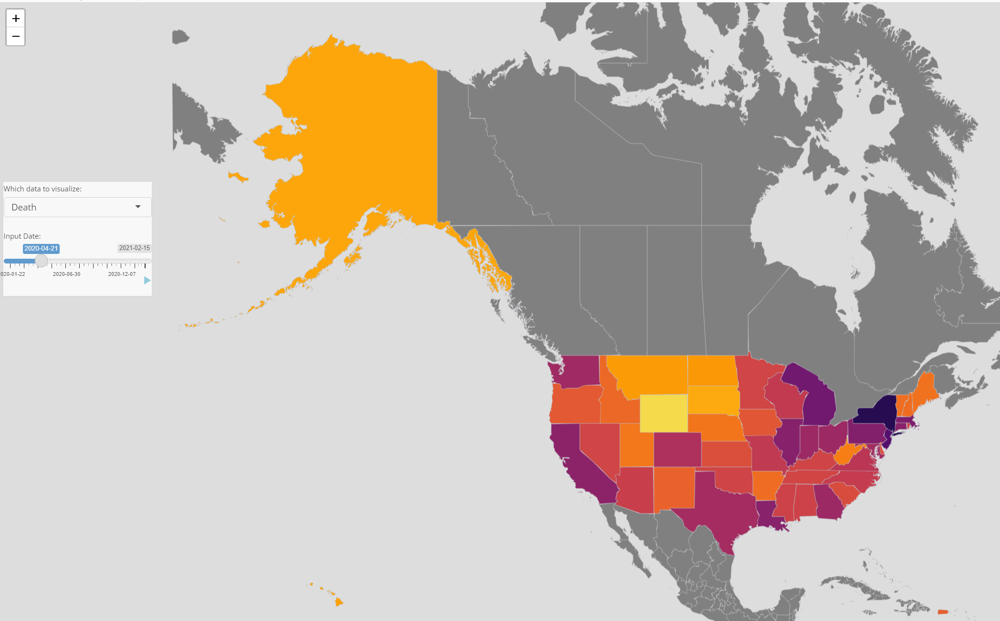

# Project 2: Shiny App Development

### [Project Description](doc/project2_desc.md)



In this second project of GR5243 Applied Data Science, we develop a *Exploratory Data Analysis and Visualization* shiny app on a topic of your choice using [JHU CSSE Covid-19 Data](https://github.com/CSSEGISandData/COVID-19) or NYC Health open data released on the [NYC Coronavirus Disease 2019 Data](https://github.com/nychealth/coronavirus-data) website. See [Project 2 Description](doc/project2_desc.md) for more details.  

The **learning goals** for this project is:

- business intelligence for data science
- study legacy codes and further development
- data cleaning
- data visualization
- systems development/design life cycle
- shiny app/shiny server

*The above general statement about project 2 can be removed once you are finished with your project. It is optional.

## COVID-19 Resilience Ranking for US States
Term: Spring 2021

+ Team #Group 1
+ **COVID-19 Resilience Ranking for US States**: + Team members
	+ Jingbin Cao
	+ Weiwei Song
	+ Yutong Yang
	+ Renyin Zhang

+ **Shiny App link**
	+ [website]() 
 
+ **Project summary**: 
In this project, we developed a website with the Shiny app to help users to have a general idea of the pandemic and to understand how each state in the US is performing during the pandemic. Utilizing data about COVID-19 in the US, we created a ranking table and related data analysis to demonstrate the best and worst places to be in during the crisis. Users can use the information provided to gauge and compare the resilience of different states. Also, we have an interactive map that displays COVID-19 cases and deaths which changes over time.

We built the covid resilience ranking for all states using indicators and indexes from 3 main modules:
	+ Status of Covid Severity: measuring a state’s pandemic severity with 1-month number of cases per 100K, 
	  1-month fatality rate, total deaths per 1M and cumulative positive test rate.
	+ Vulnerability: measuring a state’s vulnerability towards Covid-19, taking a state’s vaccinations, chronic respiratory disease mortality rate, \
	  lower respiratory infections mortality rate, and obesity prevalence into account. 
	+ Quality of Life: measuring how a state is reacting towards Covid, and the overall quality of epidemic prevention.Indicators include hospital bed occupancy, mobility, economic growth trends and so on.There is a methodology page to help users better understand the materials and the statistics as well. All this information could be of great help to the government, organizations, and companies.

+ **Contribution statement**: ([default](doc/a_note_on_contributions.md)) All team members contributed equally in all stages of this project. All team members approve our work presented in this GitHub repository including this contributions statement. 

Following [suggestions](http://nicercode.github.io/blog/2013-04-05-projects/) by [RICH FITZJOHN](http://nicercode.github.io/about/#Team) (@richfitz). This folder is orgarnized as follows.

```
proj/
├── app/
├── lib/
├── data/
├── doc/
└── output/
```

Please see each subfolder for a README file.

