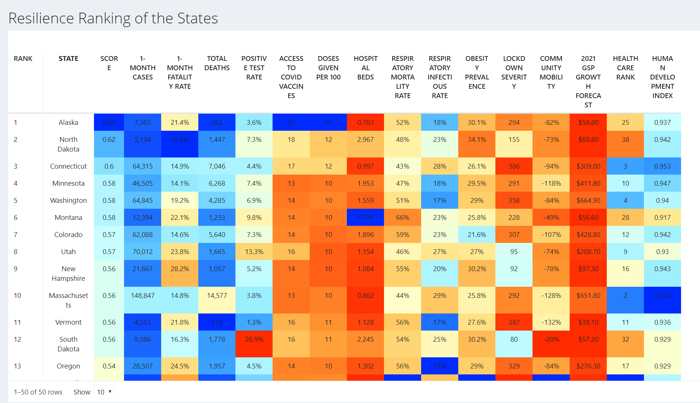
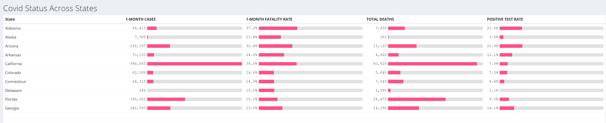
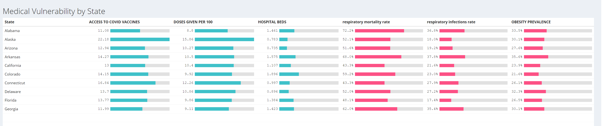
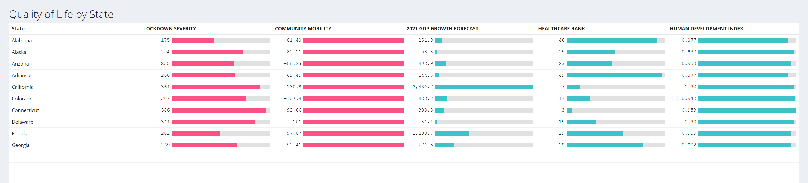

# Project 2: Shiny App Development

### [Project Description](doc/project2_desc.md)


## COVID-19 Resilience Ranking for US States
Term: Spring 2021

+ Team #Group 1
+ **COVID-19 Resilience Ranking for US States**: + Team members
	+ Jingbin Cao
	+ Weiwei Song
	+ Yutong Yang
	+ Renyin Zhang

+ **Shiny App link**
	+ [website]() 


 
+ **Project summary**: 
	+ In this project, we developed a website with the Shiny app to help users to have a general idea of the pandemic and to understand how each state in the US is performing during the pandemic. Utilizing data about COVID-19 in the US, we created a ranking table and related data analysis to demonstrate the best and worst places to be in during the crisis. Users can use the information provided to gauge and compare the resilience of different states. Also, we have an interactive map that displays COVID-19 cases and deaths which changes over time.
	+ We built the covid resilience ranking for all states using indicators and indexes from 3 main modules:
		+ Status of Covid Severity: measuring a state’s pandemic severity with 1-month number of cases per 100K, 1-month fatality rate, total deaths per 1M and cumulative positive test rate.
		
		+ Vulnerability: measuring a state’s vulnerability towards Covid-19, taking a state’s vaccinations, chronic respiratory disease mortality rate, \
	  lower respiratory infections mortality rate, and obesity prevalence into account. 
	  	
		+ Quality of Life: measuring how a state is reacting towards Covid, and the overall quality of epidemic prevention.Indicators include hospital bed occupancy, mobility, economic growth trends and so on.There is a methodology page to help users better understand the materials and the statistics as well. All this information could be of great help to the government, organizations, and companies.
		

+ **Contribution statement**: All team members approve our work presented in this GitHub repository including this contributions statement. Weiwei(WS), Yutong(YY), Jingbin(JC), Renyin(RZ) gathered the data. WS and YY focused on gathering the data using in the ranking table, building the ranking table, writing the methodology, and visualizing data by graphs. JC and RZ built the map, developed app interface, gathered data about map details, daily cases/deaths, economics, variants and vaccination for all states.

Each member contributed to the app design process. 

WS and YY came up with the essential ideas about how to choose indicators for the model, designed the reactive table and the graphical analysis page together. data searching: adding additional dataset for the three different modules to optimize this model; data cleaning: separating the indicators into two groups, and using package dplyr, tidyr to clean the data; model building: came up with the reason of choosing the indicators, built a feasible model using all the selected indicators; reactive table: used conditional styling to show the evaluations of different indicators in the resilience rank table, integrated it in the shiny app; graphical analysis: figured out which graphs should be chosen to analyze certain indicators, discussed how to make the page layout more attractive. WS merged all the Codes in the data processing process, edit and save them as data_clean_rcode.rmd .The output of this rmd file is finalized as indicators_of_model.csv. Scaled all the indicators using the max-min method, generated the core features of the model: Score and Rank, and finalized this model as final_model_table.csv. YY is the editor of the Model Methodology with a detailed explanation about why we choose these indicators and all the additional data resources as links in google docs, as a manual of guidance to understand this model. WS wrote an integral part of codes to achieve the table functions, and colors different cells using background colors and putting bar charts inside the table cell to show the evaluations for 14 indicators to achieve better visualizations. YY built all the shiny frameworks to achieve the reactive function of these tables in the shiny app and user-interactive the appearance. YY plotted the interactive time series statistical graphs of vaccinations and mobility, which gives an additional reference for the the variations of the variables as well as the review of the model. Renyin wrote the About page and the readme files.

JC wrote the big structure of the code, wrote and gathering the code from other members into global.R, ui.R, and server.R; debugged most of the errors from app operations; wrote the code for showing the maps with multiple packages and map scaling data; cleaned data for using in map and basic graphs; published the notes in Methodology Tab into ShinyApp interface; published the tables and graphs from WS and YY into ShinyApp interface; published ShinyApp into shinyapps.io.

RZ wrote all of the README files; debugged code in the map tab; desighned the details of the map; researched the possible coding strategies for map development, wrote "About" page, and revise "Methodology" page.

__________________________

Page Contribution:

Case & Death Map: JC, RZ

Ranking Table: WS, YY

Methodology: WS & YY for materials, JC for publishing

Interactive Trend Plots of Vaccinations: WS, YY

Interactive Trend Plots of Mobility: WS, YY

Basic Case/Death Graph: JC

About: RZ, JC

__________________________

Following [suggestions](http://nicercode.github.io/blog/2013-04-05-projects/) by [RICH FITZJOHN](http://nicercode.github.io/about/#Team) (@richfitz). This folder is orgarnized as follows.

```
proj/
├── app/
├── lib/
├── data/
├── doc/
└── output/
```

Please see each subfolder for a README file.

